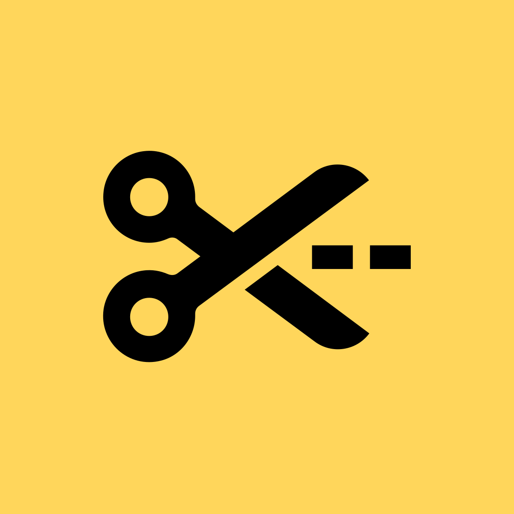

<p align="center">
  
</p>

# LLM Wiki Clipper

**A Chrome extension that clips web pages to clean markdown and saves them directly to Google Drive — built for [Andrej Karpathy's LLM Wiki](https://github.com/karpathy/llm-wiki) framework.**

> No local sync. No app lock-in. Just clip and go — your LLM Wiki raw layer lives in Google Drive, accessible from any machine.

<p align="center">
  
</p>

---

## Why LLM Wiki Clipper?

The LLM Wiki framework compiles a personal wiki from a `raw/` layer of markdown source files. But getting content *into* that raw layer — especially from the web — means copy-pasting, reformatting, and manually uploading to Drive.

This extension eliminates that friction. Browse the web normally, click the extension, and the page lands in your Drive folder as a clean markdown file with frontmatter — ready for the LLM Wiki agent to compile. No local filesystem sync, no manual formatting, works from any machine.

## Features

- **One-click full-page clip** — extracts article content with [Readability.js](https://github.com/mozilla/readability), converts to markdown with [Turndown.js](https://github.com/mixmark-io/turndown)
- **Selection clip** — right-click to clip just a highlighted selection
- **Editable title and tags** — review and customize before saving
- **Image upload** — page images are uploaded to an `images/` subfolder in Drive and linked with relative paths
- **Drive folder picker** — browse and select your target folder visually from the options page
- **Clip history** — last 10 clips accessible from the popup
- **LLM Wiki frontmatter** — every clip includes `title`, `url`, `clipped` date, `tags`, and `source_type`
- **Cross-machine sync** — settings sync via Chrome profile, install on any machine and go

## Markdown Output

Each clip is saved as `YYYY-MM-DD-page-title-slug.md`:

```markdown
---
title: "How Transformers Work"
url: "https://example.com/transformers"
clipped: "2026-04-09"
tags: ["web_clip", "research"]
source_type: web_clip
images: 3
---

# How Transformers Work

[clean article content here...]


```

This format drops directly into the LLM Wiki `raw/` layer with provenance intact.

## Installation

1. Clone or download this repository
2. Open `chrome://extensions` in Chrome
3. Enable **Developer mode** (top right)
4. Click **Load unpacked** and select the `llm-wiki-clipper` folder
5. Pin the extension to your toolbar

## Setup

You'll need a Google Cloud project to authenticate with Drive. This takes about 5 minutes.

### 1. Create a Google Cloud Project

1. Go to [console.cloud.google.com](https://console.cloud.google.com)
2. Create a new project (e.g. `llm-wiki-clipper`)
3. Enable the **Google Drive API** (APIs & Services > Library > search "Google Drive API" > Enable)

### 2. Create OAuth Credentials

1. Go to **APIs & Services > Credentials**
2. Click **Create Credentials > OAuth 2.0 Client ID**
3. Application type: **Chrome Extension**
4. Enter your extension's ID (visible at `chrome://extensions` after loading unpacked)
5. Copy the generated **Client ID**

### 3. Configure the Extension

1. Copy `manifest.json.example` to `manifest.json`
2. Replace `YOUR_GOOGLE_OAUTH_CLIENT_ID` with your Client ID:
   ```json
   "oauth2": {
     "client_id": "your-id-here.apps.googleusercontent.com",
     ...
   }
   ```
3. Reload the extension at `chrome://extensions`

### 4. Set Your Drive Folder

1. Right-click the extension icon > **Options**
2. Click **Browse** to select your LLM Wiki `raw/` folder in Google Drive
3. Optionally set default tags (e.g. `web_clip`)
4. Click **Save Settings**

## Usage

### Full-page clip (popup)
1. Navigate to any web page
2. Click the extension icon
3. Review the title, add tags if desired
4. Click **Clip to Drive**

### Selection clip (context menu)
1. Highlight text on any page
2. Right-click > **Clip selection to Drive**

### Options
Right-click the extension icon > **Options** to configure:
- **Target Drive folder** — browse and select visually
- **Default tags** — comma-separated, added to every clip

## Project Structure

```
llm-wiki-clipper/
├── manifest.json               # Chrome Manifest V3, OAuth config
├── background/
│   └── service-worker.js       # Drive API, OAuth, image uploads
├── content/
│   └── content-script.js       # Page extraction (Readability + Turndown)
├── popup/
│   ├── popup.html
│   ├── popup.js
│   └── popup.css
├── options/
│   ├── options.html            # Settings + folder picker
│   ├── options.js
│   └── options.css
├── lib/
│   ├── readability.js          # Mozilla Readability (bundled)
│   └── turndown.js             # Turndown HTML-to-MD (bundled)
└── icons/
    ├── icon16.png
    ├── icon48.png
    └── icon128.png
```

## Permissions

- **`identity`** — Google OAuth sign-in
- **`storage`** — Sync settings across machines
- **`activeTab` + `scripting`** — Read page content when you clip
- **`contextMenus`** — Right-click "Clip selection" menu
- **`host_permissions` (`https://*/*`)** — Fetch images from source pages for Drive upload
- **`drive.file` scope** — Only access files the extension creates (not your entire Drive)
- **`drive.metadata.readonly` scope** — List folders for the folder picker

## License

[MIT](LICENSE)
